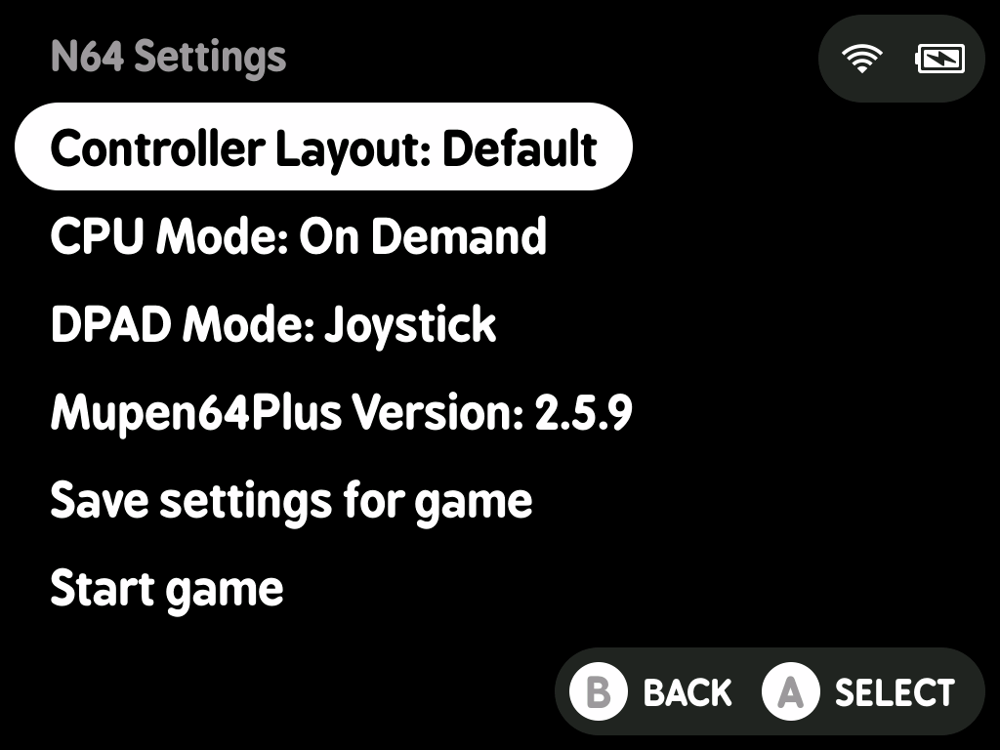

# minui-n64.pak

A MinUI Emu Pak for N64, wrapping the standalone `mupen64plus` N64 emulator (version 2.6.0).

## Requirements

This pak is designed and tested on the following MinUI Platforms and devices:

- `tg5040`: Trimui Brick (formerly `tg3040`)

Use the correct platform for your device.

## Installation

1. Mount your MinUI SD card.
2. Download the latest release from Github. It will be named `N64.pak.zip`.
3. Copy the zip file to `/Emus/$PLATFORM/N64.pak.zip`.
4. Extract the zip in place, then delete the zip file.
5. Confirm that there is a `/Emus/$PLATFORM/N64.pak/launch.sh` file on your SD card.
6. Create a folder at `/Roms/Nintendo 64 (N64)` and place your roms in this directory.
7. Unmount your SD Card and insert it into your MinUI device.

## Usage

Browse to `Nintendo 64` and press `A` to play a game.

The following filetypes are supported:

- Native: `.n64`, `.v64`, `.z64`
- Extracted: `.zip`, `.7z`

Extraction happens prior to game loading using 7-zip and can cause delays in loading the game. To avoid this, extract the game on your SD card instead.

### Controller Layouts

#### Default Controller Layout

N64 Controller Keys:

| Hardware Button | N64 Mapping |
|-----------------|-------------|
| `L2`            | `Z`         |
| `L1`            | `L`         |
| `R1`            | `R`         |
| `B`             | `A`         |
| `Y`             | `B`         |
| `R2 + X`        | `C-Up`      |
| `R2 + Y`        | `C-Left`    |
| `R2 + A`        | `C-Right`   |
| `R2 + B`        | `C-Down`    |

| Action                  | Hardware Combination |
|-------------------------|----------------------|
| MinUI Menu Resume State | `X`                  |
| Menu                    | `MENU`               |
| Load State              | `SELECT + R2`        |
| Save State              | `SELECT + L2`        |
| Screenshot              | `SELECT + L1`        |
| Toggle Pause            | `SELECT + X`         |
| Toggle Mute             | `SELECT + Y`         |
| Speed up by 5%          | `SELECT + A`         |
| Slow up by 5%           | `SELECT + B`         |

#### Lonko Controller Layout

N64 Controller Keys:

| Hardware Button | N64 Mapping |
|-----------------|-------------|
| `L2`            | `Z`         |
| `L1`            | `L`         |
| `R1`            | `R`         |
| `B`             | `A`         |
| `Y`             | `B`         |
| `R2 + X`        | `C-Up`      |
| `R2 + Y`        | `C-Left`    |
| `R2 + A`        | `C-Right`   |
| `R2 + B`        | `C-Down`    |

Hotkeys

| Action                  | Hardware Combination               |
|-------------------------|------------------------------------|
| MinUI Menu Resume State | `X`                                |
| Quit Game               | `SELECT + START`                   |
| Load State              | `SELECT + L1`, `L3`, or `HOTKEY 1` |
| Save State              | `SELECT + R1`, `R3`, or `HOTKEY 2` |
| Screenshot              | `SELECT + Y`                       |
| Toggle Pause            | `SELECT + X`                       |
| Toggle Mute             | `SELECT + B`                       |
| Reset Game              | `SELECT + A`                       |
| Fast Forward            | `SELECT + SELECT`                  |

### Emulator settings

To change emulator settings, press and hold the `R2` button while selecting/resuming a game to play. Hold R2 until a menu appears.

If the `B` or `MENU` buttons are pressed, the user is returned to the MinUI game selection screen. Settings are managed on a per-game basis, and can be saved for future gameplay, or the game can be started with the current settings as is.

#### Controller Layout

Allows changing between controller layouts.

- default: `default`
- options: `default`, `lonko`

#### CPU Mode

Allows changing the CPU Mode the emulator uses at runtime.

- default: `ondemand`
- options: `ondemand`, `performance`

#### DPAD Mode

Allows changing how the dpad is used in game.

- default: `dpad`
- options: `dpad`, `joystick`, `joystick on f2`

#### Mupen64Plus Version

Allows toggling between supported versions.

- default: `2.6.0`
- options: `2.6.0`, `2.5.9`

### In-Game saves

Any game that creates in-game saves will generate a `.eep` and `.mpk` file. These will be stored in `$SDCARD_PATH/Saves/N64`.

### Save states

In addition to in-game saves, this pak supports a single save state. Save states are stored in `$SDCARD_PATH/.userdata/shared/N64-mupen64plus`

### Screenshots

Screenshots are written to `/Screenshots` with a sanitized version of the rom name as the screenshot prefix.

### Sleep Mode

> [!NOTE]
> The screen will not turn off during the initial faux-sleep mode. This will be implemented in a future revision.

This N64.pak partially emulates sleep mode:

- Pressing the `POWER` button will pause the emulator, but will not disable the screen.
- Pressing and holding the `POWER` button for a second will shut down the device.
- If the emulator is paused for 30 seconds, the device will shut down.

If the device is shut down through either pressing and holding `POWER` _or_ waiting the 30 seconds for sleep, the emulator will briefly wake up, take an auto-resume save state, go back to sleep, and then the device will shut down. Once the device turns back on, the game will be loaded with the correct save state.

### Debug Logging

To enable debug logging, create a file named debug in `$SDCARD_PATH/.userdata/$PLATFORM/N64-mupen64plus` folder. Logs will be written to the`$SDCARD_PATH/.userdata/$PLATFORM/logs/` folder.

## Screenshots

| Name               | Image                                                     |
|--------------------|-----------------------------------------------------------|
| Emulator Settings  |  |
