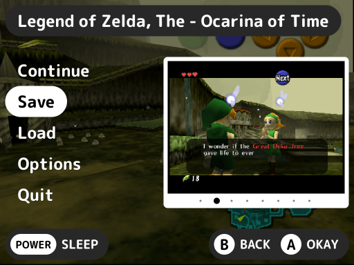

# N64 for MinUI

A MinUI Emu Pak for N64, wrapping the standalone `mupen64plus` N64 emulator (version 2.6.0).

## Requirements

This pak supports the following MinUI Platforms and devices:

- `tg5040`: TrimUI Brick (formerly `tg3040`), TrimUI Brick Pro and TrimUI Smart Pro
- `tg5050`: TrimUI Smart Pro S
- `my355`: Miyoo Flip
- `h700`: Anbernic RG28XX, RG34XX, RG34XXSP, RG35XX Plus, RG35XXH, RG35XXPro, RG35XXSP, RG40XXH, RG40XXV, RGcubeXX and RGSP, running [NextUI for H700](https://github.com/pvaibhav/NextUI)

Use the correct platform for your device.

The H700 devices are the slowest hardware this pak targets: a quad Cortex-A53 with a
Mali-G31 MP1 and 1 GB of RAM on a 32-bit memory bus. Expect the Rice plugin and modest
settings to be necessary, and avoid hi-res texture packs — unlike the other platforms
there is no swapfile to fall back on.

## Installation

1. Mount your MinUI SD card.
2. Download the latest release from Github. It will be named `N64.pak.zip`.
3. Copy the zip file to `/Emus/$PLATFORM/N64.pak.zip`.
4. Extract the zip in place, then delete the zip file.
5. Confirm that there is a `/Emus/$PLATFORM/N64.pak/launch.sh` file on your SD card.
6. Create a folder at `/Roms/Nintendo 64 (N64)` and place your roms in this directory.
7. Unmount your SD Card and insert it into your MinUI device.

## Usage

Browse to `Nintendo 64` and press `A` to play a game.

The following filetypes are supported:

- Native: `.n64`, `.v64`, `.z64`
- Extracted: `.zip`, `.7z`

Extraction happens prior to game loading using 7-zip and can cause delays in loading the game. To avoid this, extract the game on your SD card instead.

While playing:

### Quick menu

Press the **Menu** button to open the in-game quick menu.

| Action | Button |
|--------|--------|
| Open / close menu | Menu |
| Navigate | D-pad |
| Confirm | A |
| Back | B |

The quick menu has five options:

- **Continue** — close the menu and resume playing
- **Save** — save your progress to a slot (d-pad left/right to pick a slot, A to save)
- **Load** — load a previous save (same controls as Save)
- **Options** — video, audio, performance, input, and shortcut settings
- **Quit** — exit the game

### Save slots

There are 8 save slots per game. When Save or Load is highlighted, use **d-pad left/right** to cycle through slots — a preview screenshot appears on the right. Press **A** to save or load immediately.

### Power button

| Press | Action |
|-------|--------|
| Short press (< 1 second) | Sleep — screen off, audio muted, game state auto-saved |
| Long press (≥ 1 second) | Power off — exits the game cleanly |

After 2 minutes of sleep the device suspends to RAM to save battery. Press the power button to wake.

### Options

Inside Options you can adjust settings like video plugin, CPU speed, frame skip, and more. Changes take effect immediately where possible. To keep your changes across game launches, scroll to **Save Changes** at the bottom of the Options list:

- **Save for Console** — saves settings for all games
- **Save for Game** — saves settings for the current game only
- **Restore Defaults** — resets to default settings

The menu shows whether you're using default, console, or game-specific settings.

### Video plugins

Two video plugins are included:

- **Rice** (default) — faster, better performance on the Brick's hardware
- **GLideN64** — more accurate rendering, heavier on the GPU

Change the plugin in Options → Core → Video Plugin (requires restarting the game).

### Controls (Brick)

The Brick has no analog sticks, so the d-pad doubles as the N64 joystick by default. For games that use the N64 d-pad (like Kirby 64 or puzzle games), the emulator automatically switches to d-pad mode. You can also change this manually in Options → Controls → Input Mode.

C-buttons are accessed by holding **R2** and pressing a face button (this was broken in
releases up to 0.6.3 and works again now):

| Combo | N64 C-button |
|-------|-------------|
| R2 + X | C-Up |
| R2 + B | C-Down |
| R2 + Y | C-Left |
| R2 + A | C-Right |

### Controls (Smart Pro / Smart Pro S)

Both analog sticks and the d-pad work natively — left stick controls the N64 analog, right stick controls C-buttons, and the d-pad maps to the N64 d-pad. No special configuration needed.

### Controls (Brick Pro and Miyoo Flip)

Both analog sticks and the d-pad work as they do on the Smart Pro. The per-game Input Mode
switch described above is Brick-only.

### Controls (Anbernic H700)

The H700 pad reports its buttons differently from every other supported device, so the pak
ships a mapping per model and applies the right one the first time you launch a game. What
you get depends on which sticks your model has:

| Model | N64 analog stick | C-buttons |
|---|---|---|
| RG35XXH, RG35XXPro, RG40XXH, RGcubeXX, RG34XXSP | Left stick | Right stick |
| RG40XXV | Left stick | R2 + face button |
| RG28XX, RG34XX, RG35XX Plus, RG35XXSP, RGSP | D-pad | R2 + face button |

Where C-buttons come from R2, hold **R2** and press a face button by its position, the same
combos the Brick uses: R2+X for C-Up, R2+B for C-Down, R2+Y for C-Left, R2+A for C-Right.

On models with no sticks the d-pad drives the N64 analog stick *and* the N64 d-pad at once.
Nearly every N64 game reads one or the other, so this leaves neither dead.

Z Trigger is **L2** on every H700 model. If any of this feels wrong on your device, rebind
it under Options → Controls.

The in-game quick menu opens on the **Menu** button and navigates with the d-pad, A to
confirm and B to go back, the same as every other device.

### Shortcuts

You can assign buttons to common actions like fast forward, quick save/load, rewind, and screenshots. Go to Options → Shortcuts and set any face or shoulder button for each action.

## Technical documentation

For build instructions, patch details, data paths, and other developer-facing information, see [TECHNICAL.md](TECHNICAL.md).

### Debug Logging

Logs will be written to the`$SDCARD_PATH/.userdata/$PLATFORM/logs/` folder.
